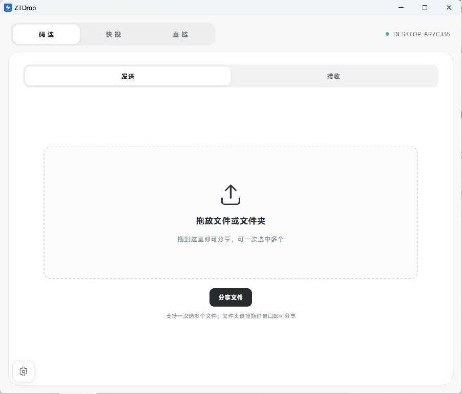
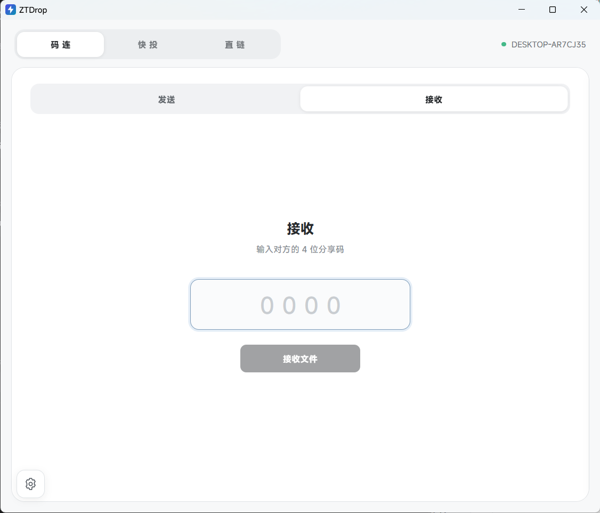
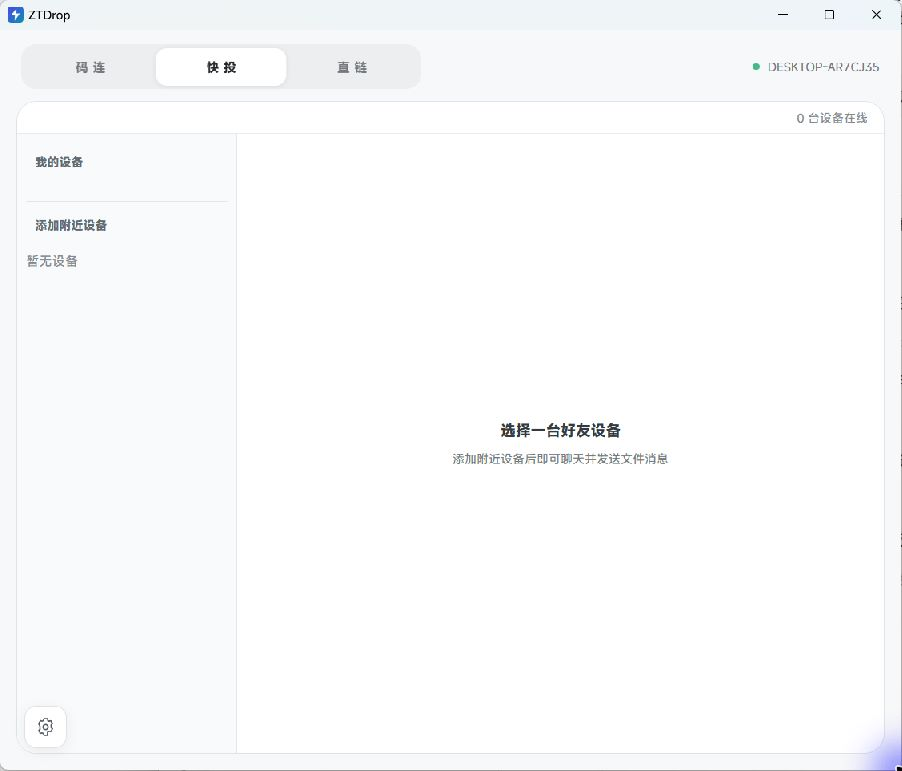
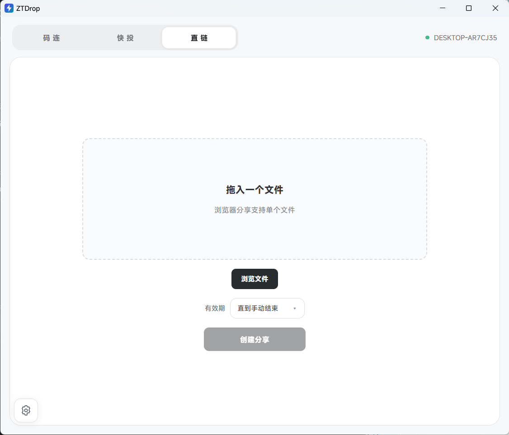

# ZTDrop：局域网文件传输与设备直连

ZTDrop 提供 Windows 版与 Android 原生版。在同一个可信局域网内，Windows 版可以用四位分享码传文件和文件夹、向附近设备发送消息与文件，也可以生成供手机或电脑浏览器下载的链接。文件直接在设备之间传输，不依赖账号、云盘或公网中继。

**Windows 当前版本：1.0.0 正式版（作者：zhuroucheng）。** 2026-10-08 按维护者要求构建；本地构建与测试结果不等同于双机、安卓互操作和多分辨率验收。

### Android 正式版（1.0.0）

Android 为独立 Kotlin 原生工程，当前仅保留最新版源码（build33），已由用户完成签名与备份。支持局域网好友/聊天、码连与直链分享、文件与文件夹传输、默认下载目录、最多8线程分段下载、暂停/续传/停止清理及设置中启用的后台前台服务。仅保留新主题；详情和构建入口见 [Android 说明](android/README.md)。旧版源码副本、APK、安卓测试文件及缓存已从工作目录清理；PC 源码与正式产物保留。

## 界面截图

### 码连 · 发送

拖入文件或文件夹即可生成四位分享码，一次可包含多个来源；对方在接收页输入分享码取走文件。



### 码连 · 接收

输入对方的 4 位分享码，选择保存位置后开始接收；大文件中断后可断点续传。



### 快投

自动发现同一局域网内的设备，添加好友后可直接发文字、文件和文件夹，并查看送达状态。



### 直链

为单个文件生成局域网链接与二维码，手机或电脑浏览器无需安装客户端即可下载，可设置有效期或手动结束。



## 功能介绍

| 功能 | 使用方式 | 通信协议 |
| --- | --- | --- |
| **码连** | 选择或拖入文件、文件夹，生成 15 分钟有效的四位分享码；另一台 ZTDrop 输入分享码后直接接收。一次分享可包含多个来源。 | UDP 52110 查码及协调分享；TCP 52111 直传文件内容。 |
| **快投** | 发现同一局域网内的设备，添加好友后发送文字、文件和文件夹；本机保留聊天记录，支持查看送达状态。 | UDP 52110 发现设备、传递好友与聊天信令、送达回执；TCP 52111 传文件内容。 |
| **直链** | 为单个文件生成局域网链接和二维码，手机或电脑浏览器无需安装客户端即可下载；支持 Range 续传，可设置有效期或手动结束。 | HTTP/1.1 经 TCP 52112 提供页面与文件流，支持 Range 分段请求。 |
| **断点续传** | 文件流式传输；中断后保留临时文件，重新连接可从已接收的位置继续。文件夹按文件逐个完成。 | 客户端使用 TCP 52111 的偏移请求；浏览器使用 HTTP Range。 |
| **分享管理** | 查看活跃分享和传输进度，可立即停止，也可选择“传完再停”：拒绝新连接，让已开始的传输完成。 | 本地管理 TCP/HTTP 分享会话和令牌。 |
| **网络与诊断** | 默认使用已连接的物理以太网或 Wi-Fi 局域网接口；提供端口、在线设备、会话和日志诊断，并可导出报告。 | 检查 UDP 52110、TCP 52111、HTTP 52112 的服务状态。 |

ZTDrop Windows 版的界面交互思路参考了 [DashBeam](https://github.com/tonyantony300/dashbeam)，使用 Tauri 2、React、TypeScript 和 Rust 构建；Android 初版使用 Kotlin 原生界面。

### 三种分享模式的通信流程

- **码连**：发送方通过 UDP 广播/定向心跳让设备互相发现，并用 UDP 协调四位码租约；接收方输入码后，通过 UDP 查询发送方地址和该分享的传输令牌，再连接发送方的 TCP 52111。TCP 连接交换文件清单和续传偏移，随后流式传输文件内容；文件数据不经过 UDP。
- **快投**：设备发现、好友请求、文字消息和送达回执使用 UDP 52110 的 v2 JSON 信令；未送达消息会保留在本机并重试。发送文件或文件夹时，先用 UDP 通知对方分享信息，接收方再通过与码连相同的 TCP 52111 文件协议下载；聊天消息本身不走 TCP 文件通道。
- **直链**：ZTDrop 在 TCP 52112 提供局域网 HTTP 服务。浏览器打开 `GET /s/<令牌>` 查看下载页，再请求 `GET /download/<令牌>` 获取文件；服务端支持 HTTP Range，浏览器可以分段或续传。浏览器不参与 UDP 设备发现，也无需安装 ZTDrop。

客户端之间的 UDP 信令采用带 `protocol_version=2` 的 JSON；TCP 文件通道使用项目自己的 `ZTB4` 握手与清单格式。直链使用普通 **HTTP，不是 HTTPS**。三种方式都只在设备间的局域网内工作，没有云端转发。

## 下载与安装

- `ZTDrop_1.0.0_x64-setup.exe`：普通 NSIS 安装包，需要目标系统具备或能够安装 WebView2 Runtime。
- `ZTDrop_1.0.0_x64-offline-setup.exe`：内置 WebView2 离线运行库，适合目标电脑无法联网安装运行库时使用。
- `ZTDrop-1.0.0-portable-Win11-x64.zip`：免安装版，解压后直接运行其中的 `ZTDrop.exe`；首次运行会在同级目录创建 `data\`。

安装包和程序目前未签名，Windows 可能显示“未知发布者”。两台电脑请使用**相同的版本**，并退出旧版以免端口被占用。Windows 10 尚未完成同等验收；Windows 7 不在当前支持范围内。

## 快速使用

1. 让两台电脑接入同一局域网 ，允许 ZTDrop 使用 UDP 52110、TCP 52111 和 TCP 52112。
2. **用分享码传输**：发送方进入“码连”并选择文件或文件夹；接收方在“码连”输入四位码，选定保存位置。
3. **设备直连**：进入“快投”，在在线设备中发起好友请求；接受后发送文字、文件或文件夹。
4. **浏览器下载**：进入“直链”，选一个文件并设置有效期；将生成的链接或二维码交给同一局域网内的接收设备。
5. 如未发现对方，先确认两端版本、物理局域网 IP、防火墙与端口，再到“设置 → 诊断”查看状态或导出报告。

“设置 → 网络 → 仅使用物理局域网”默认开启：程序按 Windows 硬件网卡属性选择已连接的以太网或 Wi-Fi 及其局域网 IPv4，使发现、消息和传输走对应物理接口。该模式面向同一 IPv4 子网；关闭后改用系统路由，流量可能经过 VPN。它不依赖不断补充 VPN 网卡名称黑名单。

## 工作方式与使用边界

- UDP 52110 用于发现、分享码协调和消息信令；TCP 52111 用于客户端文件传输；HTTP 使用 TCP 52112 提供浏览器下载。程序不做公网发现、自动端口映射或公网中继。
- 传输和浏览器下载**未加密**；四位码只适合可信局域网中的非敏感文件。不要将这些端口直接暴露到不可信网络。
- 直链目前只分享**单个文件**，不支持文件夹。手动结束的直链在程序退出后失效。
- 文件夹逐文件完成，中断后可能留下已完成文件和 `.ztdrop-*.part` 临时文件。续传依据文件大小和修改时间，不计算内容哈希；分享期间不要修改或移动源文件。
- 浏览器下载与客户端文件传输各最多同时接收 8 个连接。局域网发现和四位码协调使用 UDP，持续丢包或网络分区可能影响可见性与码唯一性。
- 删除聊天记录只影响本机，不能撤回对方已收到的内容。

## 本地数据

设备 ID、聊天记录、网络设置、日志和 WebView 缓存默认保存在 **`<ZTDrop.exe 所在目录>\data\`**。

如果程序安装在 C 盘，默认 `data\` 也在 C 盘。

## 从源码运行

在 Windows 11 上准备 Node.js、Rust MSVC 工具链、Visual Studio C++ 构建工具和 WebView2 Runtime，然后在 PowerShell 中执行：

```powershell
npm ci
npm run tauri dev
```

构建前端与运行 Rust 测试：

```powershell
npm run build
cargo test --lib --manifest-path src-tauri/Cargo.toml
cargo fmt --manifest-path src-tauri/Cargo.toml --check
```


## 2026-10-08 PC UI 与分段接收更新（待实机验收）

- 顶部码连 / 快投 / 直链导航保持原样；码连与直链分享详情使用居中圆角卡片，进入向上弹出、关闭向下收回。收回、遮罩点击和 Esc 只关闭展示，不停止分享；主界面可以重新打开详情。停止仍遵循设置中的立即停止 / 传完再停。
- PC 接收单个不小于 8 MB 的文件时，发送端声明 `range_requests: 1` 后启用最多 4 条 TCP 连接与默认 4 MB 分段（超大文件会增大分段以控制请求数量）。每段独立追加到按源文件大小、修改时间和目标路径确定的临时文件；连接中断保留实际落盘字节，重试只请求未完成部分。
- 所有分段完整后先写独立 `.merge`，再转为连续 `.part`，最后备份/替换目标文件；中断时保留旧目标。分段会额外占用接近一个文件大小的合并空间。大小、修改时间验证不等同于内容哈希验证。
- 小文件、文件夹、已有连续 `.part` 断点及未声明范围请求的旧发送端继续使用原顺序接收路径。直链 HTTP Range 发送端这轮未变更；普通浏览器并不因此自动获得 PC 客户端的四连接下载。
- 本轮验证覆盖前端构建、Rust 本机 loopback 并发/中断续传、弹窗组件浏览器交互与回滚副本；双机吞吐、Android 互操作、Tauri 实际窗口及多设备并发仍待实机验收。版本仍为 0.9.20，原 release/ 产物保持原样。
- 改动前的未提交 transfer.rs 范围请求扩展及 README 内容已经完整保留；本轮差异与原文件哈希见 `docs/maintenance/pc-ui-segments-20261008/`。


## 2026-10-08 PC 参考稿 UI 修正

- 码连与直链按 `docs/电脑端.html` 的 DOM/CSS 重新实现：500 px 居中卡片、24 px 四角圆角、顶部分享内容/接收设备两个互斥浮层。进出动画从屏幕底部移动到居中位置/返回底部，不再是贴底面板。点击顶部短横条、遮罩或 Esc 收回展示，分享继续；停止按钮遵循原有停止设置。
- 码连使用 170 px 绿色径向渐变圆心、黑色 48 px 分享码及四层扩散波纹；点击圆心复制分享码。停止按钮为参考稿的红色满宽按钮。直链使用真实后端二维码与链接，保留复制/停止及接收状态浮层。
- 快投改为参考稿的 280 px 设备侧栏、双方头像、绿色发送气泡/浅灰接收气泡及白色输入区；聊天状态位于气泡外侧。表情选择、SVG 文件附件菜单和蓝色发送按钮已接入原有消息/文件/文件夹逻辑。中文输入法组合中的 Enter 不触发发送。
- 样式位置：`src/reference-ui.css` 原样保留参考稿聊天/弹窗 CSS，再以局部覆盖适配真实 React 数据、窄窗口与减少动画设置；顶部三栏导航、下载实现、Android、原 release/ 文件保持原样。
- 已用真实 App/DirectPanel/ShareStatus 前端代码与独立本地 Tauri 数据适配器比对 HTML 原稿，不再用简化的弹窗示意组件充当 UI 验收。正式构建不包含验证适配器。实机 Tauri 窗口与双机传输仍需单独验收。源版本保持 0.9.20。

## PC 分享弹窗动效修正（2026-10-08）
码连与直链分享卡片从底部进入、向底部收回；分享内容与接收设备按钮等宽。分享码数字居中，绿色波纹保持动态。移除旧版全局黑色消息提醒框，操作结果保留调试记录，原有传输进度与错误状态保持。版本号、顶部导航、安卓与传输协议不变。构建与浏览器样例验证不等于双机实测。

## PC 自定义设备右键菜单（2026-10-08）
全界面屏蔽 WebView 默认右键菜单；快投“我的设备”好友条目支持右键或 Shift+F10 打开设备操作菜单，清空记录、删除好友从聊天标题栏移入菜单，沿用原确认与本机处理语义。右键非当前设备时操作仅针对该设备；支持方向键、Esc、点击外部关闭及窗口边缘定位。版本、传输与安卓不变。

## 聊天复制与图片预览（2026-10-08）
PC 消息支持选中文字/Ctrl+C和复制按钮；附件菜单可选择多张图片，逐张发送。图片仍使用兼容的 file 信令和原文件传输，发送方立即预览、接收方下载完成后预览，普通文件/文件夹不变。PC 支持 PNG/JPEG/GIF/WebP/BMP，预览上限10MB，超过上限或损坏时保留原文件卡片；点击图片查看大图，Esc关闭。安卓文字长按选中复制，发送/接收完成的图片缓存采样缩略图，点击大图可缩放；接收缓存使用实际SAF提交后的URI，不将本机路径或缩略图发送到信令。数据库迁移新增独立本机媒体索引，历史已下载但未记录路径的图片需重新接收。PC版本与安卓1.0.0/build33保持；新APK独立输出为未签名开发包，不覆盖正式签名备份，不操作手机。

文字消息：PC 右键气泡、Android 长按气泡可打开“复制 / 删除”菜单；图片和文件菜单提供“删除”。气泡不再显示常驻复制或删除按钮。删除只移除本机记录与预览索引，不撤回对端消息、不删除已下载文件。PC 仍支持选择文字后 Ctrl+C；安卓长按由应用菜单接管。

## 1.0.0 正式版构建

Windows 普通安装包、离线 WebView2 安装包和免安装 ZIP 位于 `release/1.0.0/`；作者 zhuroucheng 同时显示在应用“关于”、EXE 的公司名称和版权字段、安装包发布者中。Windows 文件未进行 Authenticode 签名。用户签名的 Android 1.0.0 / build33 APK 保持原样。详细构建记录与 SHA-256 见该目录的发行说明和校验清单。
